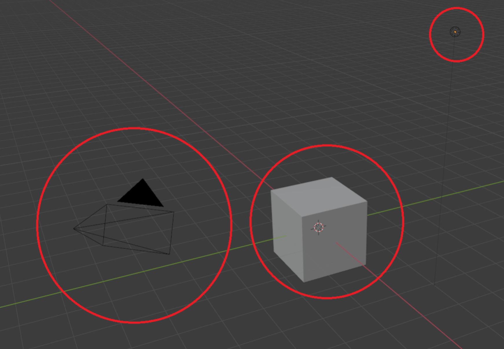

모각코_1일차
================

* * *

### TODO

컴퓨터 그래픽스(비전)을 들으면서, 3D 관련해서도 건드려보고 싶어져서 3D 모델링을 해보고, 그렇게 만든 모델링을 엔진에다가 가져다 써보는것이 목표.

\- Blender 사용법 익히기, 인터페이스 익히기 등.

* * *

##### Blender?



좌측부터 카메라 / 오브젝트 / 광원.
```
숫자패드 0 : 오브젝트 중앙뷰
숫자패드 1 : 오브젝트 측면뷰
숫자패드 3 : 오브젝트 측면(반전)뷰
숫자패드 5 : 오브젝트 측면뷰
숫자패드 7 : 오브젝트 수직(상단)뷰
숫자패드 9 : 오브젝트 수직(하단)뷰
```